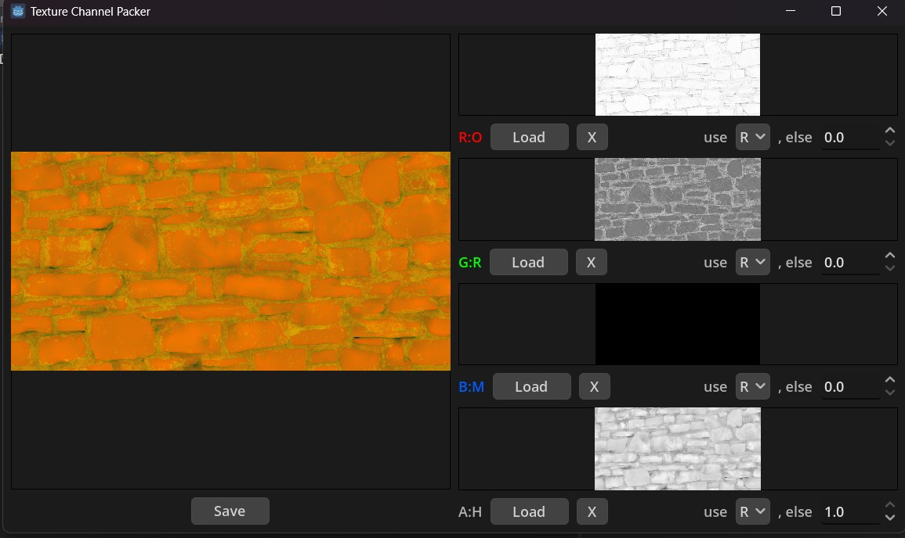

Quickly pack texture channels into one texture. Useful for ORM (occlusion, roughness, metallic) type textures where only one channel is needed.

Made with [Godot](https://godotengine.org/license/).

